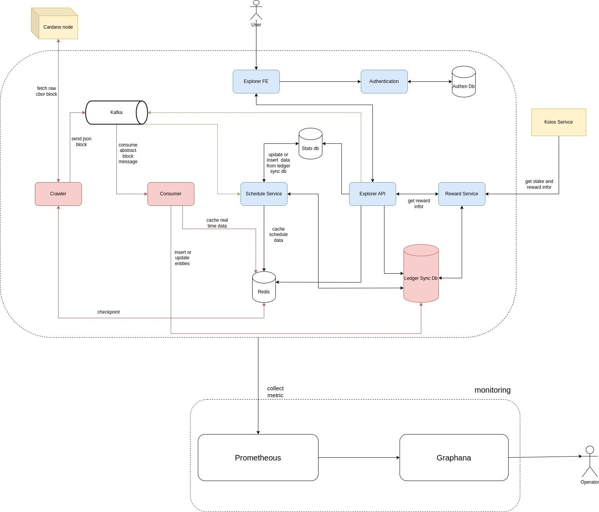

## SETUP CARDANO EXPLORER

### 1. OVERVIEW



### 2. INFRASTRUCTURES

Create a docker network for infrastructures, so that all infrastructures can communicate with each other. <br/>
```bash
docker network create cardano-infrastructure-net
```

#### 2.1 POSTGRESQL
- Version: 14 <br/>
- Run:

```bash
docker run --name cardano-postgres \ 
--network cardano-infrastructure-net \
-v ./data/postgres:/var/lib/postgresql/data \
-e POSTGRES_PASSWORD=postgres \ 
-e POSTGRES_USER=postgres \
-e POSTGRES_DB=cardano_explorer \
-p 5432:5432 -d postgres:14
```

#### 2.2 KAFKA
2.2.1 ZOOKEEPER

To start a Kafka broker, you need to start Zookeeper first.

- Version: 7.3.2
- Run:
```bash
docker run --name cardano-zookeeper \
--network cardano-infrastructure-net \
-p 2181:2181 \
-e ZOOKEEPER_CLIENT_PORT=2181 \
-e ZOOKEEPER_TICK_TIME=2000 \
-e ZOOKEEPER_SYNC_LIMIT=2 \
-d confluentinc/cp-zookeeper:7.3.2
```

2.2.2 KAFKA

After Zookeeper is started, you can start Kafka broker and connect it to Zookeeper. 

- Version: 7.3.2
- Run:
```bash
docker run --name cardano-kafka \
--network cardano-infrastructure-net \
-p 9092:9092 \
-e KAFKA_BROKER_ID=1 \
-e KAFKA_ZOOKEEPER_CONNECT=cardano-zookeeper:2181 \
-e KAFKA_LISTENERS: INTERNAL_LOCALHOST_LISTENER://localhost:19092,EXTERNAL_LISTENER://<your_ip>:9092, INTERNAL_DOCKER_LISTENER://cardano-kafka:9092 \
-e KAFKA_ADVERTISED_LISTENERS: INTERNAL_LOCALHOST_LISTENER://localhost:19092,EXTERNAL_LISTENER://<your_ip>:9092, INTERNAL_DOCKER_LISTENER://cardano-kafka:9092 \
-e KAFKA_LISTENER_SECURITY_PROTOCOL_MAP: INTERNAL_LOCALHOST_LISTENER:PLAINTEXT,EXTERNAL_LISTENER:PLAINTEXT,INTERNAL_DOCKER_LISTENER:PLAINTEXT \
-e KAFKA_INTER_BROKER_LISTENER_NAME: INTERNAL_DOCKER_LISTENER \
-e KAFKA_OFFSETS_TOPIC_REPLICATION_FACTOR=1 \
-e KAFKA_AUTO_CREATE_TOPICS_ENABLE=false \
-d confluentinc/cp-kafka:7.3.2
```

#### 2.3 REDIS
We will run redis with sentinel mode. So we need to start a redis master, a redis slave and a redis sentinel. <br/>

2.3.1 REDIS MASTER
- Version: 7.0.5 <br/>
- Run:
```bash
docker run --name cardano-redis-master \
--network cardano-infrastructure-net \
-e REDIS_REPLICATION_MODE=master \
-e REDIS_PASSWORD=redis_master_pw \
-p 6379:6379 \
-d redis:7.0.5
```
2.3.2 REDIS SLAVE
- Version: 7.0.5
- Run:
```bash
docker run --name cardano-redis-slave \
--network cardano-infrastructure-net \
-e REDIS_REPLICATION_MODE=slave \
-e REDIS_MASTER_HOST=cardano-redis-master \
-p 6380:6379 \
-d redis:7.0.5 \
redis-server --slaveof cardano-redis-master 6379
```
2.3.3 REDIS SENTINEL
- Version: 7.0
- Run:
```bash
docker run --name cardano-redis-sentinel \
--network cardano-infrastructure-net \
-p 26379:26379 \
-e REDIS_MASTER_HOST=cardano-redis-master \
-e REDIS_MASTER_PORT_NUMBER=6379 \
-e REDIS_MASTER_PASSWORD=redis_master_pw \
-e REDIS_MASTER_SET=cardano-redis-master \
-e REDIS_SENTINEL_PASSWORD=redis_sentinel_pw \
-e REDIS_SENTINEL_QUORUM=2 \
-e REDIS_SENTINEL_DOWN_AFTER_MILLISECONDS=30000 \
-e REDIS_SENTINEL_FAILOVER_TIMEOUT=180000 \
-d bitnami/redis-sentinel:7.0
```

#### 2.4 MINIO  
- Version: RELEASE.2023-07-11T21-29-34Z
- Run:
```bash
docker run --name cardano-minio \
--network cardano-infrastructure-net \
-v ./data/minio:/data \
-p 9000:9000 \
-p 9001:9001 \
-e MINIO_ROOT_USER=minio \
-e MINIO_ROOT_PASSWORD=minio123 \
-d minio/minio:RELEASE.2023-07-11T21-29-34Z server /data --console-address ":9001"
```
---

### 3. SERVICES

#### 3.1 CRAWLER
Crawler is a service that crawls raw data from Cardano blockchain and sends it to Kafka. <br/>

#### 3.2 CONSUMER
Consumer is a service that consumes data from Kafka and stores it in Postgresql and Redis. <br/>

#### 3.3 SCHEDULE
Schedule is a service that schedules tasks for Crawler and Consumer. <br/>

#### 3.4 REWARD

#### 3.5 AUTHENTICATION

#### 3.6 API

#### 3.7 FRONTEND

